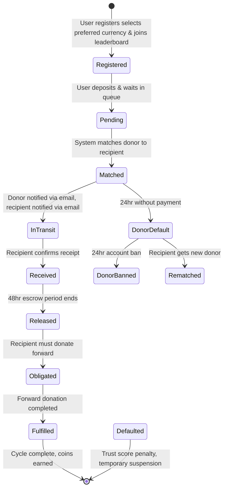
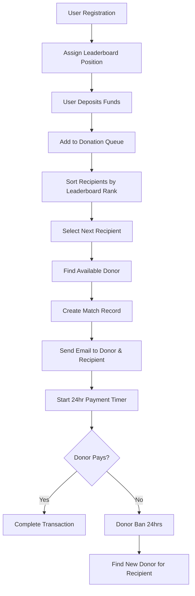
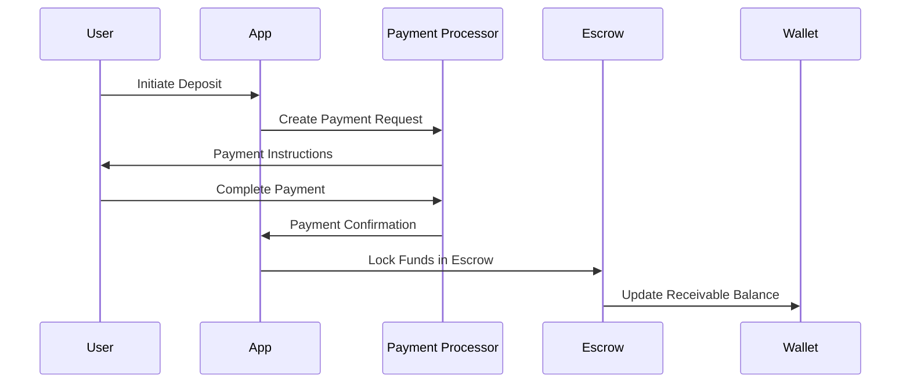
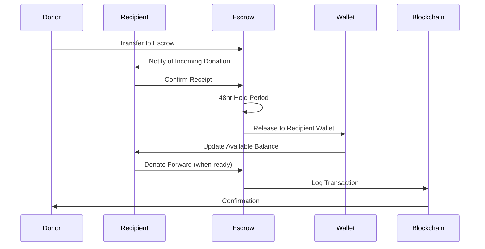
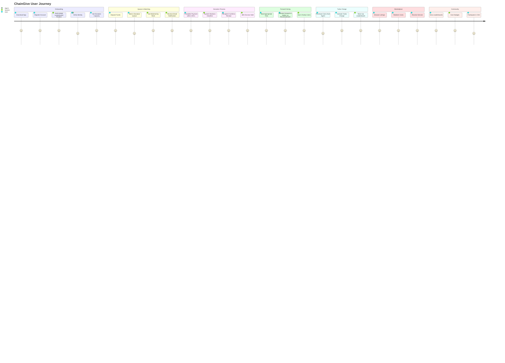

# ChainGive Logic Architecture & Algorithms

## Overview

This document outlines the comprehensive logic architecture for the ChainGive donation application, detailing how all features work together to create a sustainable peer-to-peer giving ecosystem. The architecture is built around core principles of dignity, transparency, and community sovereignty.

## Table of Contents

1. [Core Donation Cycle Logic](#1-core-donation-cycle-logic)
2. [Matching Algorithm Architecture](#2-matching-algorithm-architecture)
3. [Wallet & Financial Flow Logic](#3-wallet--financial-flow-logic)
4. [Gamification & Rewards System](#4-gamification--rewards-system)
5. [Agent Network Operations](#5-agent-network-operations)
6. [Marketplace & Coin System](#6-marketplace--coin-system)
7. [Trust & Safety Framework](#7-trust--safety-framework)
8. [System Integration Flow](#8-system-integration-flow)

---

## 1. Core Donation Cycle Logic

### Cycle States & Transitions

The donation cycle follows a strict state machine with the following states:



### State Logic Rules

#### **Registered State**
- User creates account and is automatically matched to the next available number 1 position in the leaderboard
- Initial position is based on registration time (earlier registration = higher initial position)
- User can purchase coins from agents to enable Turbo Charge functionality for leaderboard advancement

#### **Pending State**
- User deposits funds and joins donation queue
- All accounts must wait in line for their turn to receive donations
- Leaderboard ranking determines the order in which users receive donations (higher rank = receives first)
- Upon making a donation, the user joins the leaderboard at their matched position
- Leaderboard ranking is measured by time of registration, donation cycles completed, turbo charge upgrades, and other gamification rewards amassed

#### **Matched State**
- System matches donor to recipient based on leaderboard ranking (highest ranked recipient gets matched first)
- Donor receives email notification of match
- Donor receives email notification once they are matched to a recipient
- 24-hour default limit begins for donor to complete payment
- Email warnings sent if approaching deadline
- Default limit is 24 hours, after which if the donor does not pay to the matched recipient, the donor's account is banned for 24 hours while the awaiting recipient is matched with a new donor

#### **In Transit State**
- Donor has been notified and payment window is active
- Recipient waits for transfer confirmation
- If donor doesn't pay within 24 hours: donor banned for 24 hours, recipient gets new match

#### **Received State**
- Recipient confirms receipt in app
- 48-hour escrow hold begins
- Dispute window opens (3 days)

#### **Released State**
- Funds move to recipient's provided bank account not available balance
- Recipient becomes obligated to donate forward
- 7-90 day forward donation window begins

#### **Obligated State**
- Recipient must donate same amount forward or higher as recommitment or is banned after 14 days
- System monitors for forward donation
- Gentle reminders after 3 days

#### **Fulfilled State**
- Recommitment donation completed
- Charity Coins awarded based on speed
- Trust score increases
- Cycle marked complete

#### **Defaulted State**
- No forward donation within 14 days
- Trust score penalty (-10 points)
- Temporary suspension from receiving
- Can be recovered through future good behavior

#### **DonorDefault State**
- Donor fails to pay within 24 hours of match
- Automatic 24-hour account ban
- Recipient immediately matched with next available donor

#### **DonorBanned State**
- Temporary suspension prevents new matches
- Email notifications sent to donor
- Automatic reinstatement after 24 hours

### Cycle Timing Logic

```typescript
interface CycleTiming {
  receiveToGive: {
    minimum: 7,    // days
    recommended: 30,
    maximum: 90
  },
  escrowHold: 48,    // hours
  disputeWindow: 3,  // days (reduced for faster resolution)
  matchExpiry: 24,   // hours (donor payment deadline)
  donorBanDuration: 24, // hours (for missed payments)
  emailWarningThreshold: 20, // hours (warning before ban)
  recommitmentDeadline: 14 // days (must donate forward or higher, or banned)
}
```

### Cycle Completion Algorithm

```typescript
function calculateCycleReward(cycle: Cycle): CharityCoins {
  const daysToComplete = cycle.daysToFulfill;

  if (daysToComplete <= 14) return 50;
  if (daysToComplete <= 30) return 30;
  if (daysToComplete <= 60) return 10;
  return 0; // No reward after 60 days
}

function calculateRecommitmentBonus(cycle: Cycle): CharityCoins {
  const originalAmount = cycle.originalAmount;
  const recommitmentAmount = cycle.recommitmentAmount;

  if (recommitmentAmount > originalAmount) {
    const bonusPercentage = (recommitmentAmount - originalAmount) / originalAmount;
    return Math.floor(bonusPercentage * 100); // Bonus coins for higher recommitment
  }

  return 0;
}

function calculateParticipationMultiplier(user: User): number {
  const activities = [
    user.cyclesCompleted,
    user.turboChargesUsed,
    user.referralsMade,
    user.marketplaceRedemptions,
    user.agentInteractions
  ];

  const totalActivity = activities.reduce((sum, activity) => sum + activity, 0);
  return Math.min(2.0, 1 + (totalActivity * 0.1)); // Max 2x multiplier
}

function calculateTotalCycleReward(cycle: Cycle, user: User): CharityCoins {
  const baseReward = calculateCycleReward(cycle);
  const recommitmentBonus = calculateRecommitmentBonus(cycle);
  const participationMultiplier = calculateParticipationMultiplier(user);

  return Math.floor((baseReward + recommitmentBonus) * participationMultiplier);
}
```

---

## 2. Matching Algorithm Architecture

### Matching Priority Score

The matching algorithm uses a weighted scoring system:

```typescript
interface MatchScore {
  trustScore: number;      // 40% weight
  geographicProximity: number; // 20% weight
  amountCompatibility: number;  // 20% weight
  waitTimePriority: number;     // 20% weight
}

function calculatePriorityScore(
  donor: User,
  recipient: User,
  amount: number
): number {
  const trustWeight = 0.4;
  const geoWeight = 0.2;
  const amountWeight = 0.2;
  const waitWeight = 0.2;

  return (
    (donor.trustScore * trustWeight) +
    (calculateGeoScore(donor, recipient) * geoWeight) +
    (calculateAmountScore(amount, recipient.capacity) * amountWeight) +
    (calculateWaitScore(recipient.waitTime) * waitWeight)
  );
}
```

### Geographic Proximity Logic

```typescript
function calculateGeoScore(donor: User, recipient: User): number {
  const distance = calculateDistance(
    donor.location,
    recipient.location
  );

  if (distance <= 10) return 1.0;     // Same city
  if (distance <= 50) return 0.8;     // Same state
  if (distance <= 200) return 0.6;    // Same region
  return 0.4;                         // Different region
}
```

### Anti-Gaming Measures

1. **Clique Prevention**: No user can match with same person twice in 6 months
2. **Randomization Factor**: 10% random selection to prevent predictability
3. **New User Priority**: First-time recipients matched with high-trust donors
4. **Velocity Checks**: Maximum 3 matches per user per week

### Matching Engine Flow



---

## 3. Wallet & Financial Flow Logic

### Wallet Structure

```typescript
interface Wallet {
  userId: string;
  fiatBalance: {
    available: number;      // Spendable funds
    receivable: number;     // In escrow, waiting release
    pendingObligations: number; // Amount owed forward
  };
  charityCoins: {
    earned: number;         // From completed cycles
    bonus: number;          // From referrals, campaigns
  };
}
```

### Transaction Flow Logic

#### **Deposit Flow**


#### **Donation Flow**


### Balance Update Logic

```typescript
function updateWalletBalances(
  wallet: Wallet,
  transaction: Transaction
): Wallet {
  switch (transaction.type) {
    case 'deposit':
      return {
        ...wallet,
        fiatBalance: {
          ...wallet.fiatBalance,
          receivable: wallet.fiatBalance.receivable + transaction.amount
        }
      };

    case 'escrow_release':
      return {
        ...wallet,
        fiatBalance: {
          available: wallet.fiatBalance.available + transaction.amount,
          receivable: wallet.fiatBalance.receivable - transaction.amount
        }
      };

    case 'donation_sent':
      return {
        ...wallet,
        fiatBalance: {
          available: wallet.fiatBalance.available - transaction.amount,
          pendingObligations: wallet.fiatBalance.pendingObligations + transaction.amount
        }
      };

    case 'donation_received':
      return {
        ...wallet,
        fiatBalance: {
          pendingObligations: wallet.fiatBalance.pendingObligations - transaction.amount
        }
      };
  }
}
```

---

## 4. Gamification & Rewards System

### Badge System Logic

```typescript
interface Badge {
  id: string;
  name: string;
  description: string;
  icon: string;
  criteria: BadgeCriteria;
  rarity: 'common' | 'rare' | 'epic' | 'legendary';
}

const BADGES: Badge[] = [
  {
    id: 'first_step',
    name: 'First Step',
    criteria: { cyclesCompleted: 1 },
    rarity: 'common'
  },
  {
    id: 'on_fire',
    name: 'On Fire',
    criteria: { cyclesIn30Days: 3 },
    rarity: 'rare'
  },
  {
    id: 'champion',
    name: 'Champion',
    criteria: { totalCycles: 10 },
    rarity: 'epic'
  },
  {
    id: 'diamond_giver',
    name: 'Diamond Giver',
    criteria: { totalCycles: 50 },
    rarity: 'legendary'
  }
];
```

### Charity Coin Earning Logic

```typescript
function calculateCoinsEarned(cycle: Cycle): number {
  const baseReward = 100; // First cycle
  const speedMultiplier = calculateSpeedMultiplier(cycle.daysToFulfill);
  const consistencyBonus = calculateConsistencyBonus(cycle.user);
  const communityBonus = calculateCommunityBonus(cycle.user);

  return Math.floor(baseReward * speedMultiplier + consistencyBonus + communityBonus);
}

function calculateSpeedMultiplier(days: number): number {
  if (days <= 14) return 1.5;  // 50 coins
  if (days <= 30) return 1.0;  // 30 coins
  if (days <= 60) return 0.3;  // 10 coins
  return 0;                    // 0 coins
}
```

### Leaderboard Logic

```typescript
interface LeaderboardEntry {
  userId: string;
  displayName: string;
  rank: number;
  score: number; // Composite score
  registrationTime: Date;
  cyclesCompleted: number;
  turboChargesUsed: number;
  gamificationPoints: number;
  referralsMade: number;
  marketplaceActivity: number;
  trend: 'up' | 'down' | 'same';
}

function calculateLeaderboardScore(user: User): number {
  const weights = {
    registrationTime: 1000, // Earlier registration = higher base score
    cyclesCompleted: 100,
    turboChargesUsed: 50,
    gamificationPoints: 10,
    referralsMade: 25,
    marketplaceActivity: 5,
    timeDecay: 0.95, // Slight decay per month for fairness
    votingParticipationPenalty: -20 // Penalty for not voting in Donor Council elections
  };

  const monthsSinceRegistration = calculateMonthsSince(user.registrationDate);
  const baseScore = weights.registrationTime / Math.pow(weights.timeDecay, monthsSinceRegistration);

  const activityScore = (
    (user.cyclesCompleted * weights.cyclesCompleted) +
    (user.turboChargesUsed * weights.turboChargesUsed) +
    (user.gamificationPoints * weights.gamificationPoints) +
    (user.referralsMade * weights.referralsMade) +
    (user.marketplaceActivity * weights.marketplaceActivity)
  );

  // Apply voting participation penalty
  const votingPenalty = (user.leaderboardDemotionPenalty || 0) * weights.votingParticipationPenalty;

  // Apply activity consistency bonus
  const consistencyMultiplier = calculateActivityConsistency(user);
  const finalScore = (baseScore + activityScore + votingPenalty) * consistencyMultiplier;

  return Math.floor(finalScore);
}

function calculateActivityConsistency(user: User): number {
  const recentActivity = getUserActivityLast30Days(user.id);
  const averageActivity = recentActivity / 30;

  if (averageActivity >= 2) return weights.activityBonus; // Daily active
  if (averageActivity >= 1) return 1.1; // Weekly active
  if (averageActivity >= 0.3) return 1.05; // Monthly active
  return 1.0; // Low activity
}

function generateLeaderboard(): LeaderboardEntry[] {
  return users
    .filter(user => user.isActive && !user.isBanned) // Only active, non-banned users
    .map(user => ({
      userId: user.id,
      displayName: user.displayName,
      score: calculateLeaderboardScore(user),
      registrationTime: user.registrationDate,
      cyclesCompleted: user.cyclesCompleted,
      turboChargesUsed: user.turboChargesUsed,
      gamificationPoints: user.gamificationPoints,
      referralsMade: user.referralsMade,
      marketplaceActivity: user.marketplaceActivity,
      trend: calculateTrend(user.id)
    }))
    .sort((a, b) => b.score - a.score) // Higher score = better rank
    .map((entry, index) => ({
      ...entry,
      rank: index + 1
    }));
}

function updateLeaderboardRanks(): void {
  const leaderboard = generateLeaderboard();

  // Update user ranks in database
  leaderboard.forEach(entry => {
    updateUserRank(entry.userId, entry.rank);
  });

  // Trigger rank change notifications
  notifyRankChanges(leaderboard);
}
```

### Turbo Charge Logic

```typescript
interface TurboCharge {
  userId: string;
  activationCost: number; // Dynamic coin cost
  activationCount: number; // Number of times used
  lastActivated: Date;
  cooldownPeriod: number; // Hours between activations
}

function calculateTurboChargeCost(user: User): number {
  const baseCost = 100;
  const escalationFactor = 1.5; // Cost increases by 50% each time
  const maxCost = 1000; // Cap at 1000 coins

  const calculatedCost = baseCost * Math.pow(escalationFactor, user.turboChargesUsed);
  return Math.min(maxCost, Math.floor(calculatedCost));
}

function checkTurboChargeCooldown(user: User): boolean {
  if (!user.lastTurboChargeActivation) return true;

  const hoursSinceLastActivation = calculateHoursSince(user.lastTurboChargeActivation);
  return hoursSinceLastActivation >= 24; // 24 hour cooldown
}

function activateTurboCharge(user: User): TurboChargeResult {
  // Check cooldown
  if (!checkTurboChargeCooldown(user)) {
    return {
      success: false,
      reason: 'COOLDOWN_ACTIVE',
      cooldownRemaining: calculateCooldownRemaining(user)
    };
  }

  const cost = calculateTurboChargeCost(user);

  if (user.charityCoins < cost) {
    return { success: false, reason: 'INSUFFICIENT_COINS' };
  }

  // Deduct coins
  user.charityCoins -= cost;
  user.turboChargesUsed += 1;
  user.lastTurboChargeActivation = new Date();

  // Move up one notch in the ranking, displacing the user immediately below them
  const currentRank = getUserRank(user.id);
  if (currentRank > 1) {
    // Swap positions with the user immediately below
    swapLeaderboardPositions(currentRank, currentRank - 1);
  }

  // Award gamification points for strategic use
  awardTurboChargePoints(user);

  return {
    success: true,
    newRank: Math.max(1, currentRank - 1),
    coinsSpent: cost,
    nextActivationAvailable: new Date(Date.now() + 24 * 60 * 60 * 1000)
  };
}

function calculateCooldownRemaining(user: User): number {
  if (!user.lastTurboChargeActivation) return 0;

  const hoursSinceLastActivation = calculateHoursSince(user.lastTurboChargeActivation);
  return Math.max(0, 24 - hoursSinceLastActivation);
}
```

---

## 5. Agent Network Operations

### Agent Role Logic

```typescript
interface Agent {
  userId: string;
  agentCode: string;
  verificationCount: number;
  rating: number;
  services: AgentService[];
  status: 'active' | 'suspended' | 'inactive';
}

enum AgentService {
  IDENTITY_VERIFICATION = 'identity_verification',
  CASH_DEPOSIT = 'cash_deposit',
  DISPUTE_MEDIATION = 'dispute_mediation',
  EDUCATION = 'education'
}
```

### Agent Assignment Algorithm

```typescript
function assignAgent(
  user: User,
  service: AgentService,
  location: Location
): Agent | null {
  const eligibleAgents = getAgentsByServiceAndLocation(service, location);

  // Sort by rating, then by distance, then by workload
  const sortedAgents = eligibleAgents.sort((a, b) => {
    if (a.rating !== b.rating) return b.rating - a.rating;
    if (a.distance !== b.distance) return a.distance - b.distance;
    return a.currentWorkload - b.currentWorkload;
  });

  return sortedAgents[0] || null;
}
```

### Agent Quality Control

```typescript
function updateAgentRating(agent: Agent, newRating: number): Agent {
  const currentRating = agent.rating;
  const totalRatings = agent.totalRatings;

  const newTotalRatings = totalRatings + 1;
  const newRatingValue = ((currentRating * totalRatings) + newRating) / newTotalRatings;

  return {
    ...agent,
    rating: Math.round(newRatingValue * 10) / 10, // Round to 1 decimal
    totalRatings: newTotalRatings
  };
}

function checkAgentSuspension(agent: Agent): boolean {
  return agent.rating < 4.0 || agent.complaintsLastMonth > 5;
}
```

### Agent Commission Logic

```typescript
function calculateAgentCommission(
  service: AgentService,
  amount: number,
  agent: Agent
): number {
  const baseRates = {
    [AgentService.IDENTITY_VERIFICATION]: 200, // Flat fee
    [AgentService.CASH_DEPOSIT]: amount * 0.02, // 2% of amount
    [AgentService.DISPUTE_MEDIATION]: 500, // Flat fee if resolved
    [AgentService.EDUCATION]: 1000, // Flat fee per session
    [AgentService.COIN_SALES]: amount * 0.05 // 5% commission on coin sales
  };

  const performanceMultiplier = calculateAgentPerformanceMultiplier(agent);
  const baseCommission = baseRates[service];

  return Math.floor(baseCommission * performanceMultiplier);
}

function calculateAgentPerformanceMultiplier(agent: Agent): number {
  const rating = agent.rating;
  const totalVerifications = agent.totalVerifications;
  const successRate = agent.successRate;

  let multiplier = 1.0;

  // Rating bonus
  if (rating >= 4.8) multiplier += 0.2;
  else if (rating >= 4.5) multiplier += 0.1;
  else if (rating < 4.0) multiplier -= 0.1;

  // Experience bonus
  if (totalVerifications > 100) multiplier += 0.15;
  else if (totalVerifications > 50) multiplier += 0.1;
  else if (totalVerifications > 20) multiplier += 0.05;

  // Success rate bonus
  if (successRate >= 0.95) multiplier += 0.1;
  else if (successRate < 0.90) multiplier -= 0.1;

  return Math.max(0.5, Math.min(2.0, multiplier)); // Clamp between 0.5x and 2.0x
}

function distributeAgentRevenue(agent: Agent, commission: number): void {
  const platformFee = commission * 0.1; // 10% platform fee
  const agentEarnings = commission * 0.9; // 90% to agent

  // Update agent wallet
  agent.walletBalance += agentEarnings;

  // Record transaction
  createAgentCommissionTransaction(agent.id, agentEarnings, platformFee);
}
```

---

## 6. Marketplace & Coin System

### Coin Redemption Logic

```typescript
interface MarketplaceListing {
  id: string;
  vendor: string;
  item: string;
  coinPrice: number;
  realValue: number;
  category: 'airtime' | 'data' | 'vouchers' | 'services';
  stock: number;
  paymentMethods: PaymentMethod[];
}

function validateRedemption(
  user: User,
  listing: MarketplaceListing
): RedemptionResult {
  if (user.charityCoins < listing.coinPrice) {
    return { success: false, reason: 'INSUFFICIENT_COINS' };
  }

  if (listing.stock <= 0) {
    return { success: false, reason: 'OUT_OF_STOCK' };
  }

  return { success: true };
}

function processRedemption(
  user: User,
  listing: MarketplaceListing,
  deliveryDetails: DeliveryDetails
): Redemption {
  // Deduct coins
  user.charityCoins -= listing.coinPrice;

  // Create redemption record
  const redemption = {
    id: generateId(),
    userId: user.id,
    listingId: listing.id,
    coinsSpent: listing.coinPrice,
    realValue: listing.realValue,
    status: 'processing',
    deliveryMethod: deliveryDetails.method,
    deliveryData: deliveryDetails.data
  };

  // Update inventory
  listing.stock -= 1;

  return redemption;
}
```

### Partner Integration Logic

```typescript
interface PartnerIntegration {
  name: string;
  apiEndpoint: string;
  authentication: AuthMethod;
  supportedServices: ServiceType[];
  rateLimits: RateLimit;
}

function processPartnerRedemption(
  redemption: Redemption,
  partner: PartnerIntegration
): Promise<RedemptionResult> {
  switch (partner.name) {
    case 'MTN':
      return processMTNAirtime(redemption, partner);
    case 'Airtel':
      return processAirtelData(redemption, partner);
    case 'Jumia':
      return processJumiaVoucher(redemption, partner);
    default:
      throw new Error(`Unsupported partner: ${partner.name}`);
  }
}
```

### Coin Economy Balance

```typescript
interface CoinEconomyMetrics {
  totalCoinsInCirculation: number;
  totalCoinsRedeemed: number;
  totalCoinsFromTurboCharge: number;
  totalCoinsFromAgentSales: number;
  averageRedemptionRate: number;
  turboChargeUsageRate: number;
  agentSalesVolume: number;
  coinVelocity: number; // How quickly coins circulate
}

function monitorCoinEconomy(): EconomyHealth {
  const metrics = calculateCoinMetrics();

  const health = {
    circulation: metrics.totalCoinsInCirculation,
    redeemed: metrics.totalCoinsRedeemed,
    redemptionRate: metrics.averageRedemptionRate,
    velocity: metrics.coinVelocity,
    status: determineEconomyStatus(metrics)
  };

  // Trigger interventions based on health
  if (health.status === 'deflationary') {
    triggerCoinInjectionCampaign();
  } else if (health.status === 'inflationary') {
    increaseRedemptionValues();
  }

  return health;
}

function calculateCoinMetrics(): CoinEconomyMetrics {
  const totalEarned = getTotalCoinsEarned();
  const totalRedeemed = getTotalCoinsSpent();
  const totalFromTurbo = getTotalCoinsFromTurboCharges();
  const totalFromAgents = getTotalCoinsFromAgentSales();

  return {
    totalCoinsInCirculation: totalEarned - totalRedeemed,
    totalCoinsRedeemed: totalRedeemed,
    totalCoinsFromTurboCharge: totalFromTurbo,
    totalCoinsFromAgentSales: totalFromAgents,
    averageRedemptionRate: totalRedeemed / totalEarned,
    turboChargeUsageRate: calculateTurboChargeUsageRate(),
    agentSalesVolume: totalFromAgents,
    coinVelocity: calculateCoinVelocity()
  };
}

function determineEconomyStatus(metrics: CoinEconomyMetrics): 'healthy' | 'inflationary' | 'deflationary' {
  const redemptionRate = metrics.averageRedemptionRate;
  const velocity = metrics.coinVelocity;

  if (redemptionRate < 0.6 && velocity < 0.8) return 'deflationary';
  if (redemptionRate > 0.9 && velocity > 1.2) return 'inflationary';
  return 'healthy';
}

function triggerCoinInjectionCampaign(): void {
  // Increase coin rewards for cycles
  increaseCycleRewards(1.2); // 20% increase

  // Offer bonus coins for referrals
  activateReferralBonusCampaign();

  // Notify agents to promote coin purchases
  notifyAgentsOfCoinDemand();
}

function increaseRedemptionValues(): void {
  // Slightly decrease coin requirements for redemptions
  adjustMarketplacePrices(0.95); // 5% decrease in coin cost

  // Add flash sales
  createFlashSaleEvent();
}
```

---

## 7. Trust & Safety Framework

### Trust Score Calculation

```typescript
interface TrustFactors {
  completionRate: number;      // % of cycles completed on time
  averageSpeed: number;        // Average days to complete cycles
  communityEndorsements: number; // Positive ratings from other users
  agentVerification: boolean;  // Has agent-verified identity
  accountAge: number;          // Days since registration
  negativeIncidents: number;   // Complaints, defaults, etc.
}

function calculateTrustScore(user: User): number {
  const factors = calculateTrustFactors(user);

  const weights = {
    completionRate: 0.3,
    averageSpeed: 0.2,
    communityEndorsements: 0.2,
    agentVerification: 0.15,
    accountAge: 0.1,
    negativeIncidents: -0.05 // Penalty
  };

  let score = 0;
  score += factors.completionRate * weights.completionRate;
  score += (91 - factors.averageSpeed) * weights.averageSpeed; // Lower days = higher score
  score += Math.min(factors.communityEndorsements, 50) * weights.communityEndorsements;
  score += (factors.agentVerification ? 1 : 0) * weights.agentVerification;
  score += Math.min(factors.accountAge / 365, 1) * weights.accountAge;
  score += factors.negativeIncidents * weights.negativeIncidents;

  return Math.max(0, Math.min(5, score)); // Clamp between 0-5
}
```

### Fraud Detection Logic

```typescript
interface FraudPattern {
  name: string;
  condition: (user: User, transaction: Transaction) => boolean;
  severity: 'low' | 'medium' | 'high';
  action: FraudAction;
}

const FRAUD_PATTERNS: FraudPattern[] = [
  {
    name: 'multiple_accounts',
    condition: (user, tx) => checkMultipleAccounts(user.deviceId),
    severity: 'high',
    action: 'suspend_account'
  },
  {
    name: 'rapid_transactions',
    condition: (user, tx) => checkTransactionVelocity(user.id, 10, 60), // 10 tx in 60 min
    severity: 'medium',
    action: 'flag_for_review'
  },
  {
    name: 'suspicious_amounts',
    condition: (user, tx) => tx.amount > user.tierLimits.maxAmount,
    severity: 'medium',
    action: 'require_additional_verification'
  }
];

function detectFraud(user: User, transaction: Transaction): FraudAction[] {
  return FRAUD_PATTERNS
    .filter(pattern => pattern.condition(user, transaction))
    .map(pattern => pattern.action);
}
```

### Dispute Resolution Logic

```typescript
interface Dispute {
  id: string;
  cycleId: string;
  complainantId: string;
  respondentId: string;
  type: 'non_receipt' | 'wrong_amount' | 'fraud' | 'other';
  evidence: Evidence[];
  status: 'open' | 'under_review' | 'resolved' | 'escalated';
  resolution?: DisputeResolution;
}

function resolveDispute(dispute: Dispute, councilDecision: CouncilVote): DisputeResolution {
  const majorityVote = getMajorityVote(councilDecision);

  switch (majorityVote) {
    case 'refund_complainant':
      return {
        action: 'refund',
        amount: dispute.cycle.amount,
        recipient: dispute.complainantId,
        reason: 'Dispute resolved in favor of complainant'
      };

    case 'maintain_transaction':
      return {
        action: 'no_action',
        reason: 'Dispute dismissed, transaction valid'
      };

    case 'split_funds':
      return {
        action: 'split',
        amount: dispute.cycle.amount / 2,
        reason: 'Funds split between parties'
      };
  }
}
```

### Donor Council Election Logic

```typescript
interface DonorCouncilElection {
  week: number;
  startDate: Date;
  endDate: Date;
  candidates: DonorCandidate[];
  voters: Voter[];
  results: ElectionResult[];
  totalVotesCast: number;
  totalCoinsSpent: number;
}

interface DonorCandidate {
  userId: string;
  donorStats: DonorStats;
  eligibilityScore: number;
  totalPoints: number;
  rank: number;
}

interface DonorStats {
  donationsThisWeek: number;
  referralsThisWeek: number;
  coinBalance: number;
  activityScore: number;
  totalDonations: number;
}

function runDonorCouncilElection(): DonorCandidate[] {
  const eligibleCandidates = getEligibleDonorCandidates();
  const eligibleVoters = getEligibleVoters();

  // Check mandatory voting participation
  const votingParticipation = checkVotingParticipation(eligibleVoters);
  if (!votingParticipation.allVoted) {
    applyLeaderboardDemotions(votingParticipation.nonVoters);
  }

  const electionResults = eligibleCandidates.map(candidate => ({
    candidate,
    points: calculateRankedVotePoints(candidate.id),
    coinRewards: 0 // Will be calculated after winners selected
  }));

  // Sort by total points descending
  electionResults.sort((a, b) => b.points - a.points);

  // Select top 3 winners and distribute rewards
  const winners = electionResults.slice(0, 3);
  distributeElectionRewards(winners);

  // Record election results
  recordElectionResults(electionResults);

  // Notify winners and community
  notifyElectionResults(winners, electionResults);

  return winners.map(result => result.candidate);
}

function getEligibleDonorCandidates(): DonorCandidate[] {
  return users
    .filter(user => !user.isBanned && user.accountAge >= 7) // 7 days minimum
    .map(user => ({
      userId: user.id,
      donorStats: calculateWeeklyDonorStats(user.id),
      eligibilityScore: calculateDonorEligibilityScore(user),
      totalPoints: 0,
      rank: 0
    }))
    .filter(candidate => candidate.eligibilityScore >= 50) // Minimum eligibility threshold
    .sort((a, b) => b.eligibilityScore - a.eligibilityScore)
    .slice(0, 20); // Top 20 candidates
}

function calculateDonorEligibilityScore(user: User): number {
  const weeklyStats = calculateWeeklyDonorStats(user.id);

  const weights = {
    donationsThisWeek: 30,
    referralsThisWeek: 25,
    coinBalance: 20,
    activityScore: 15,
    totalDonations: 10
  };

  const score = (
    (weeklyStats.donationsThisWeek * weights.donationsThisWeek) +
    (weeklyStats.referralsThisWeek * weights.referralsThisWeek) +
    (Math.min(user.charityCoins, 1000) / 10 * weights.coinBalance) + // Cap at 1000 coins
    (weeklyStats.activityScore * weights.activityScore) +
    (user.totalDonations * weights.totalDonations)
  );

  return Math.min(100, score); // Cap at 100
}

function calculateWeeklyDonorStats(userId: string): DonorStats {
  const weekStart = getWeekStart();
  const weekEnd = getWeekEnd();

  return {
    donationsThisWeek: countUserDonationsInPeriod(userId, weekStart, weekEnd),
    referralsThisWeek: countUserReferralsInPeriod(userId, weekStart, weekEnd),
    coinBalance: getUserCoinBalance(userId),
    activityScore: calculateUserActivityScore(userId, weekStart, weekEnd),
    totalDonations: getUserTotalDonations(userId)
  };
}

function calculateRankedVotePoints(candidateId: string): number {
  // 1st place = 3 points, 2nd place = 2 points, 3rd place = 1 point
  const firstPlaceVotes = countVotesForCandidateAtRank(candidateId, 1);
  const secondPlaceVotes = countVotesForCandidateAtRank(candidateId, 2);
  const thirdPlaceVotes = countVotesForCandidateAtRank(candidateId, 3);

  return (firstPlaceVotes * 3) + (secondPlaceVotes * 2) + (thirdPlaceVotes * 1);
}

function submitVote(voterId: string, votes: {first: string, second: string, third: string}): VoteResult {
  const voter = getUser(voterId);

  // Check if voter has enough coins (20 per vote)
  const costPerVote = 20;
  const totalCost = costPerVote * 3; // 3 votes

  if (voter.charityCoins < totalCost) {
    return { success: false, reason: 'INSUFFICIENT_COINS' };
  }

  // Deduct coins
  voter.charityCoins -= totalCost;

  // Record votes
  recordRankedVotes(voterId, votes, totalCost);

  return { success: true, coinsSpent: totalCost };
}

function checkVotingParticipation(eligibleVoters: User[]): {allVoted: boolean, nonVoters: User[]} {
  const nonVoters = eligibleVoters.filter(voter => !hasUserVotedThisWeek(voter.id));
  return {
    allVoted: nonVoters.length === 0,
    nonVoters
  };
}

function applyLeaderboardDemotions(nonVoters: User[]): void {
  nonVoters.forEach(user => {
    // Apply demotion penalty in leaderboard score calculation
    user.leaderboardDemotionPenalty = (user.leaderboardDemotionPenalty || 0) + 10;
  });
}

function distributeElectionRewards(winners: ElectionResult[]): void {
  const totalCoinsCollected = getTotalElectionCoinsSpent();
  const platformFee = totalCoinsCollected * 0.35; // 35% platform fee
  const rewardPool = totalCoinsCollected - platformFee;

  // Distribute to winners (equal split for simplicity, can be adjusted)
  const rewardPerWinner = Math.floor(rewardPool / 3);

  winners.forEach((winner, index) => {
    const winnerUser = getUser(winner.candidate.userId);
    winnerUser.charityCoins += rewardPerWinner;

    // Convert portion to currency if requested
    if (winnerUser.autoConvertRewards) {
      convertCoinsToCurrency(winnerUser.id, rewardPerWinner * 0.5); // Convert 50% to currency
    }
  });
}

function convertCoinsToCurrency(userId: string, coinAmount: number): void {
  const user = getUser(userId);
  const dollarValue = coinAmount * 0.25; // 1 coin = $0.25
  const currencyAmount = convertToUserCurrency(dollarValue, user.preferredCurrency);

  // Add to user's fiat wallet
  user.fiatBalance.available += currencyAmount;

  // Record conversion transaction
  recordCurrencyConversion(userId, coinAmount, currencyAmount, user.preferredCurrency);
}
```

---

## 8. System Integration Flow

### Complete User Journey



### System Health Monitoring

```typescript
interface SystemHealth {
  donationVelocity: number;    // Donations per day
  averageCycleTime: number;    // Days to complete cycle
  defaultRate: number;         // % of cycles not completed
  donorDefaultRate: number;    // % of donors missing 24hr deadline
  agentUtilization: number;    // % of agents actively working
  marketplaceConversion: number; // % of coins redeemed
  trustScoreAverage: number;   // Average user trust score
  leaderboardEngagement: number; // % of users using Turbo Charge
  queueEfficiency: number;     // Average time from deposit to match
}

function monitorSystemHealth(): SystemHealth {
  return {
    donationVelocity: calculateDonationVelocity(),
    averageCycleTime: calculateAverageCycleTime(),
    defaultRate: calculateDefaultRate(),
    donorDefaultRate: calculateDonorDefaultRate(),
    agentUtilization: calculateAgentUtilization(),
    marketplaceConversion: calculateMarketplaceConversion(),
    trustScoreAverage: calculateAverageTrustScore(),
    leaderboardEngagement: calculateTurboChargeUsage(),
    queueEfficiency: calculateAverageQueueTime()
  };
}

function triggerSystemAlerts(health: SystemHealth): Alert[] {
  const alerts: Alert[] = [];

  if (health.defaultRate > 0.15) {
    alerts.push({
      level: 'critical',
      message: 'Recipient default rate exceeds 15%',
      action: 'Review user engagement strategies'
    });
  }

  if (health.donorDefaultRate > 0.10) {
    alerts.push({
      level: 'critical',
      message: 'Donor default rate exceeds 10%',
      action: 'Review email notification system and payment flows'
    });
  }

  if (health.agentUtilization < 0.6) {
    alerts.push({
      level: 'warning',
      message: 'Agent utilization below 60%',
      action: 'Recruit more agents or redistribute workload'
    });
  }

  if (health.queueEfficiency > 3600) { // 1 hour
    alerts.push({
      level: 'warning',
      message: 'Average queue time exceeds 1 hour',
      action: 'Scale matching engine or optimize algorithm'
    });
  }

  return alerts;
}
```

### Performance Optimization Logic

```typescript
interface PerformanceMetrics {
  apiResponseTime: number;
  matchingAlgorithmTime: number;
  databaseQueryTime: number;
  cacheHitRate: number;
  errorRate: number;
  leaderboardCalculationTime: number;
  notificationDeliveryTime: number;
  concurrentUsers: number;
}

function optimizeSystemPerformance(metrics: PerformanceMetrics): OptimizationAction[] {
  const actions: OptimizationAction[] = [];

  if (metrics.apiResponseTime > 500) {
    actions.push('Implement API response caching');
    actions.push('Enable HTTP/2 for better multiplexing');
  }

  if (metrics.matchingAlgorithmTime > 300) {
    actions.push('Optimize matching algorithm with spatial indexing');
    actions.push('Implement parallel processing for large user pools');
  }

  if (metrics.databaseQueryTime > 100) {
    actions.push('Add database indexes on frequently queried columns');
    actions.push('Implement query result caching');
    actions.push('Consider database read replicas');
  }

  if (metrics.cacheHitRate < 0.8) {
    actions.push('Increase Redis cache size and TTL');
    actions.push('Implement cache warming strategies');
  }

  if (metrics.leaderboardCalculationTime > 5000) {
    actions.push('Implement incremental leaderboard updates');
    actions.push('Use background job processing for rank calculations');
  }

  if (metrics.notificationDeliveryTime > 1000) {
    actions.push('Implement notification batching');
    actions.push('Use push notification queuing');
  }

  if (metrics.concurrentUsers > 10000) {
    actions.push('Implement horizontal scaling');
    actions.push('Add load balancer with session affinity');
  }

  return actions;
}

### Scalability Considerations

```typescript
interface ScalabilityMetrics {
  userGrowthRate: number;
  transactionVolume: number;
  peakConcurrentUsers: number;
  dataRetentionPeriod: number;
  backupFrequency: number;
}

function planScalability(scalabilityMetrics: ScalabilityMetrics): ScalingPlan {
  const plan = {
    infrastructure: [],
    database: [],
    caching: [],
    monitoring: []
  };

  if (scalabilityMetrics.userGrowthRate > 0.1) { // 10% monthly growth
    plan.infrastructure.push('Implement auto-scaling groups');
    plan.database.push('Plan for database sharding');
  }

  if (scalabilityMetrics.transactionVolume > 100000) { // 100k daily transactions
    plan.infrastructure.push('Add read replicas');
    plan.caching.push('Implement distributed caching');
  }

  if (scalabilityMetrics.peakConcurrentUsers > 50000) {
    plan.infrastructure.push('Implement CDN for static assets');
    plan.monitoring.push('Add real-time performance monitoring');
  }

  return plan;
}

### Error Handling & Recovery Logic

```typescript
interface ErrorRecoveryStrategy {
  errorType: string;
  retryAttempts: number;
  backoffStrategy: 'linear' | 'exponential';
  fallbackAction: string;
  notificationRequired: boolean;
}

const ERROR_RECOVERY_STRATEGIES: ErrorRecoveryStrategy[] = [
  {
    errorType: 'PAYMENT_PROCESSOR_DOWN',
    retryAttempts: 3,
    backoffStrategy: 'exponential',
    fallbackAction: 'Queue for manual processing',
    notificationRequired: true
  },
  {
    errorType: 'DATABASE_CONNECTION_LOST',
    retryAttempts: 5,
    backoffStrategy: 'linear',
    fallbackAction: 'Switch to read-only mode',
    notificationRequired: true
  },
  {
    errorType: 'NOTIFICATION_DELIVERY_FAILED',
    retryAttempts: 2,
    backoffStrategy: 'linear',
    fallbackAction: 'Store for later retry',
    notificationRequired: false
  }
];

function handleSystemError(error: SystemError): Promise<RecoveryResult> {
  const strategy = ERROR_RECOVERY_STRATEGIES.find(s => s.errorType === error.type);

  if (!strategy) {
    return Promise.reject(new Error(`No recovery strategy for ${error.type}`));
  }

  return executeRecoveryStrategy(error, strategy);
}
```

---

## 9. Additional System Logic & Helper Functions

### Helper Functions & Utilities

```typescript
// Time calculation utilities
function calculateMonthsSince(date: Date): number {
  const now = new Date();
  const diffTime = Math.abs(now.getTime() - date.getTime());
  return Math.floor(diffTime / (1000 * 60 * 60 * 24 * 30.44)); // Average month length
}

function calculateHoursSince(date: Date): number {
  const now = new Date();
  const diffTime = Math.abs(now.getTime() - date.getTime());
  return Math.floor(diffTime / (1000 * 60 * 60));
}

function getWeekStart(): Date {
  const now = new Date();
  const dayOfWeek = now.getDay(); // 0 = Sunday, 1 = Monday, etc.
  const startOfWeek = new Date(now);
  startOfWeek.setDate(now.getDate() - dayOfWeek + 1); // Monday as start
  startOfWeek.setHours(0, 0, 0, 0);
  return startOfWeek;
}

function getWeekEnd(): Date {
  const weekStart = getWeekStart();
  const weekEnd = new Date(weekStart);
  weekEnd.setDate(weekStart.getDate() + 6); // Sunday
  weekEnd.setHours(23, 59, 59, 999);
  return weekEnd;
}

// User activity and statistics functions
function countUserDonationsInPeriod(userId: string, startDate: Date, endDate: Date): number {
  return transactions
    .filter(tx =>
      tx.fromUserId === userId &&
      tx.type === 'donation_sent' &&
      tx.createdAt >= startDate &&
      tx.createdAt <= endDate
    ).length;
}

function countUserReferralsInPeriod(userId: string, startDate: Date, endDate: Date): number {
  return referrals
    .filter(ref =>
      ref.referrerId === userId &&
      ref.createdAt >= startDate &&
      ref.createdAt <= endDate &&
      ref.status === 'completed'
    ).length;
}

function getUserCoinBalance(userId: string): number {
  const user = getUser(userId);
  return user ? user.charityCoins : 0;
}

function calculateUserActivityScore(userId: string, startDate: Date, endDate: Date): number {
  const donations = countUserDonationsInPeriod(userId, startDate, endDate);
  const referrals = countUserReferralsInPeriod(userId, startDate, endDate);
  const marketplaceActivity = countUserMarketplaceActivity(userId, startDate, endDate);
  const agentInteractions = countUserAgentInteractions(userId, startDate, endDate);

  return donations + (referrals * 2) + (marketplaceActivity * 0.5) + agentInteractions;
}

function getUserTotalDonations(userId: string): number {
  return transactions
    .filter(tx => tx.fromUserId === userId && tx.type === 'donation_sent')
    .length;
}

function countUserMarketplaceActivity(userId: string, startDate: Date, endDate: Date): number {
  return redemptions
    .filter(redemption =>
      redemption.userId === userId &&
      redemption.createdAt >= startDate &&
      redemption.createdAt <= endDate
    ).length;
}

function countUserAgentInteractions(userId: string, startDate: Date, endDate: Date): number {
  return agentInteractions
    .filter(interaction =>
      interaction.userId === userId &&
      interaction.createdAt >= startDate &&
      interaction.createdAt <= endDate
    ).length;
}

// Voting and election functions
function countVotesForCandidateAtRank(candidateId: string, rank: number): number {
  return votes
    .filter(vote =>
      (rank === 1 && vote.firstChoice === candidateId) ||
      (rank === 2 && vote.secondChoice === candidateId) ||
      (rank === 3 && vote.thirdChoice === candidateId)
    ).length;
}

function recordRankedVotes(voterId: string, votes: {first: string, second: string, third: string}, cost: number): void {
  const voteRecord = {
    id: generateId(),
    voterId,
    firstChoice: votes.first,
    secondChoice: votes.second,
    thirdChoice: votes.third,
    coinsSpent: cost,
    week: getCurrentWeekNumber(),
    createdAt: new Date()
  };

  // Save to database
  saveVoteRecord(voteRecord);
}

function hasUserVotedThisWeek(userId: string): boolean {
  const currentWeek = getCurrentWeekNumber();
  return votes.some(vote =>
    vote.voterId === userId &&
    vote.week === currentWeek
  );
}

function getTotalElectionCoinsSpent(): number {
  const currentWeek = getCurrentWeekNumber();
  return votes
    .filter(vote => vote.week === currentWeek)
    .reduce((total, vote) => total + vote.coinsSpent, 0);
}

function recordElectionResults(results: ElectionResult[]): void {
  const electionRecord = {
    id: generateId(),
    week: getCurrentWeekNumber(),
    results,
    totalVotesCast: results.reduce((sum, result) => sum + result.votes, 0),
    totalCoinsSpent: getTotalElectionCoinsSpent(),
    createdAt: new Date()
  };

  saveElectionRecord(electionRecord);
}

function notifyElectionResults(winners: DonorCandidate[], results: ElectionResult[]): void {
  // Notify winners
  winners.forEach(winner => {
    sendNotification(winner.userId, 'election_win', {
      rank: winner.rank,
      reward: winner.coinRewards
    });
  });

  // Notify all participants
  sendBroadcastNotification('election_complete', {
    winners: winners.map(w => w.userId),
    totalVotes: results.reduce((sum, r) => sum + r.votes, 0)
  });
}

// Leaderboard and ranking functions
function swapLeaderboardPositions(currentRank: number, targetRank: number): void {
  const currentUser = getUserByRank(currentRank);
  const targetUser = getUserByRank(targetRank);

  if (currentUser && targetUser) {
    updateUserRank(currentUser.id, targetRank);
    updateUserRank(targetUser.id, currentRank);
  }
}

function awardTurboChargePoints(user: User): void {
  user.gamificationPoints += 10; // Award points for strategic use
  checkBadgeUnlocks(user, 'turbo_charge_master');
}

function calculateTrend(userId: string): 'up' | 'down' | 'same' {
  const currentRank = getUserRank(userId);
  const previousRank = getUserPreviousRank(userId);

  if (currentRank < previousRank) return 'up';
  if (currentRank > previousRank) return 'down';
  return 'same';
}

// Coin economy functions
function getTotalCoinsEarned(): number {
  return users.reduce((total, user) => total + user.totalCoinsEarned, 0);
}

function getTotalCoinsSpent(): number {
  return redemptions.reduce((total, redemption) => total + redemption.coinsSpent, 0) +
         turboCharges.reduce((total, charge) => total + charge.cost, 0) +
         votes.reduce((total, vote) => total + vote.coinsSpent, 0);
}

function getTotalCoinsFromTurboCharges(): number {
  return turboCharges.reduce((total, charge) => total + charge.cost, 0);
}

function getTotalCoinsFromAgentSales(): number {
  return agentTransactions
    .filter(tx => tx.type === 'coin_sale')
    .reduce((total, tx) => total + tx.amount, 0);
}

function calculateCoinVelocity(): number {
  const totalCoins = getTotalCoinsInCirculation();
  const coinsSpentThisMonth = getCoinsSpentInPeriod(getMonthStart(), getMonthEnd());
  return coinsSpentThisMonth / totalCoins;
}

function increaseCycleRewards(multiplier: number): void {
  // Temporarily increase coin rewards for cycle completions
  CYCLE_REWARD_MULTIPLIER = multiplier;
  setTimeout(() => {
    CYCLE_REWARD_MULTIPLIER = 1.0; // Reset after campaign period
  }, 7 * 24 * 60 * 60 * 1000); // 1 week
}

function activateReferralBonusCampaign(): void {
  // Double referral rewards for limited time
  REFERRAL_BONUS_MULTIPLIER = 2.0;
  setTimeout(() => {
    REFERRAL_BONUS_MULTIPLIER = 1.0;
  }, 7 * 24 * 60 * 60 * 1000);
}

function notifyAgentsOfCoinDemand(): void {
  const agents = getAllActiveAgents();
  agents.forEach(agent => {
    sendNotification(agent.userId, 'coin_demand_high', {
      action: 'increase_coin_sales'
    });
  });
}

function adjustMarketplacePrices(multiplier: number): void {
  marketplaceListings.forEach(listing => {
    listing.coinPrice = Math.floor(listing.coinPrice * multiplier);
  });
}

function createFlashSaleEvent(): void {
  const flashSale = {
    id: generateId(),
    discount: 0.7, // 30% off
    duration: 2 * 60 * 60 * 1000, // 2 hours
    categories: ['airtime', 'data'],
    startTime: new Date(),
    endTime: new Date(Date.now() + 2 * 60 * 60 * 1000)
  };

  activateFlashSale(flashSale);
}

// System health monitoring functions
function calculateDonationVelocity(): number {
  const last24Hours = getDonationsInPeriod(getLast24HoursStart(), new Date());
  return last24Hours.length / 1; // Per day
}

function calculateAverageCycleTime(): number {
  const completedCycles = cycles.filter(c => c.status === 'fulfilled');
  if (completedCycles.length === 0) return 0;

  const totalDays = completedCycles.reduce((sum, cycle) => sum + cycle.daysToFulfill, 0);
  return totalDays / completedCycles.length;
}

function calculateDefaultRate(): number {
  const totalCycles = cycles.length;
  const defaultedCycles = cycles.filter(c => c.status === 'defaulted').length;
  return defaultedCycles / totalCycles;
}

function calculateDonorDefaultRate(): number {
  const matchedDonations = matches.length;
  const defaultedMatches = matches.filter(m =>
    m.status === 'expired' &&
    calculateHoursSince(m.matchedAt) >= 24
  ).length;
  return defaultedMatches / matchedDonations;
}

function calculateAgentUtilization(): number {
  const totalAgents = agents.filter(a => a.status === 'active').length;
  const activeAgents = agents.filter(a =>
    a.status === 'active' &&
    a.currentWorkload > 0
  ).length;
  return activeAgents / totalAgents;
}

function calculateMarketplaceConversion(): number {
  const totalRedemptions = redemptions.length;
  const totalCoinsSpent = redemptions.reduce((sum, r) => sum + r.coinsSpent, 0);
  const totalCoinsEarned = getTotalCoinsEarned();
  return totalCoinsSpent / totalCoinsEarned;
}

function calculateAverageTrustScore(): number {
  const activeUsers = users.filter(u => u.isActive && !u.isBanned);
  if (activeUsers.length === 0) return 0;

  const totalScore = activeUsers.reduce((sum, user) => sum + user.trustScore, 0);
  return totalScore / activeUsers.length;
}

function calculateTurboChargeUsage(): number {
  const totalUsers = users.filter(u => u.isActive).length;
  const turboUsers = users.filter(u => u.turboChargesUsed > 0).length;
  return turboUsers / totalUsers;
}

function calculateAverageQueueTime(): number {
  const completedMatches = matches.filter(m => m.status === 'completed');
  if (completedMatches.length === 0) return 0;

  const totalWaitTime = completedMatches.reduce((sum, match) => {
    const waitTime = calculateHoursSince(match.createdAt);
    return sum + waitTime;
  }, 0);

  return (totalWaitTime / completedMatches.length) * 3600; // Convert to seconds
}
```

### Missing State Transitions & Edge Cases

```typescript
// Recommitment failure handling
function handleRecommitmentFailure(user: User): void {
  // Apply ban for 24 hours
  user.isBanned = true;
  user.banReason = 'Failed to complete recommitment within 14 days';
  user.banExpiresAt = new Date(Date.now() + 24 * 60 * 60 * 1000);

  // Notify user
  sendNotification(user.id, 'recommitment_failure', {
    banDuration: '24 hours',
    reinstatementTime: user.banExpiresAt
  });

  // Cancel any pending matches
  cancelUserPendingMatches(user.id);
}

// Turbo charge position collision handling
function handleTurboChargePositionCollision(currentRank: number): number {
  const usersAtTargetRank = getUsersByRank(currentRank - 1);
  if (usersAtTargetRank.length > 1) {
    // If multiple users at target rank, displace the one with lowest activity score
    const targetUser = usersAtTargetRank.sort((a, b) =>
      calculateUserActivityScore(a.id, getWeekStart(), getWeekEnd()) -
      calculateUserActivityScore(b.id, getWeekStart(), getWeekEnd())
    )[0];

    return displaceUser(targetUser.id, currentRank);
  }

  return currentRank - 1;
}

// Election tie-breaking logic
function resolveElectionTies(candidates: DonorCandidate[]): DonorCandidate[] {
  // Sort by total points, then by eligibility score, then by random factor
  return candidates.sort((a, b) => {
    if (a.totalPoints !== b.totalPoints) return b.totalPoints - a.totalPoints;
    if (a.eligibilityScore !== b.eligibilityScore) return b.eligibilityScore - a.eligibilityScore;
    return Math.random() - 0.5; // Random tiebreaker
  });
}

// Currency conversion rate management
function updateCurrencyRates(): void {
  // Fetch latest rates from external API
  const rates = fetchCurrencyRates();
  cacheCurrencyRates(rates, 24 * 60 * 60 * 1000); // Cache for 24 hours
}

function convertToUserCurrency(dollarAmount: number, targetCurrency: string): number {
  const rates = getCachedCurrencyRates();
  const rate = rates[targetCurrency] || 1; // Default to 1 if not found
  return dollarAmount * rate;
}
```

### Missing Validation & Business Rules

```typescript
// Account age validation
function validateFeatureAccess(user: User, feature: string): boolean {
  const ageRequirements = {
    'turbo_charge': 7,      // 7 days
    'agent_services': 7,    // 7 days
    'donor_council_vote': 30, // 30 days
    'marketplace_redemption': 1, // 1 day
    'leadership_roles': 90   // 90 days
  };

  const requiredAge = ageRequirements[feature] || 0;
  return calculateDaysSince(user.registrationDate) >= requiredAge;
}

// Concurrent match prevention
function validateNewMatch(userId: string): ValidationResult {
  const activeMatches = matches.filter(m =>
    (m.donorId === userId || m.recipientId === userId) &&
    m.status === 'active'
  );

  if (activeMatches.length > 0) {
    return {
      valid: false,
      reason: 'User already has an active donation cycle'
    };
  }

  return { valid: true };
}

// Coin balance limits
function enforceCoinBalanceLimits(user: User): void {
  const maxCoins = 10000; // Maximum coin balance
  if (user.charityCoins > maxCoins) {
    // Convert excess to currency
    const excessCoins = user.charityCoins - maxCoins;
    convertCoinsToCurrency(user.id, excessCoins);
    user.charityCoins = maxCoins;
  }
}

// Geographic service restrictions
function validateServiceAvailability(service: string, userLocation: Location): boolean {
  const restrictedServices = {
    'mobile_money': ['NG', 'GH', 'KE'], // Only available in specific countries
    'bank_transfer': ['NG'], // Nigeria only
    'crypto_deposit': ['NG', 'GH'] // Limited countries
  };

  const allowedCountries = restrictedServices[service];
  return !allowedCountries || allowedCountries.includes(userLocation.country);
}
```

### Missing Integration Points

```typescript
// Email template system
interface EmailTemplate {
  id: string;
  subject: string;
  body: string;
  variables: string[];
}

const EMAIL_TEMPLATES: Record<string, EmailTemplate> = {
  'match_notification': {
    subject: 'You have been matched for a donation!',
    body: 'Dear {{firstName}}, you have been matched with {{recipientName}} for a ₦{{amount}} donation.',
    variables: ['firstName', 'recipientName', 'amount']
  },
  'payment_reminder': {
    subject: 'Payment reminder - {{hoursLeft}} hours remaining',
    body: 'You have {{hoursLeft}} hours to complete your payment to {{recipientName}}.',
    variables: ['hoursLeft', 'recipientName']
  },
  'recommitment_failure': {
    subject: 'Account temporarily suspended',
    body: 'Your account has been suspended for 24 hours due to missing recommitment deadline.',
    variables: []
  }
};

function sendTemplatedEmail(userId: string, templateId: string, variables: Record<string, any>): void {
  const user = getUser(userId);
  const template = EMAIL_TEMPLATES[templateId];

  if (!template || !user.email) return;

  let subject = template.subject;
  let body = template.body;

  // Replace variables
  Object.entries(variables).forEach(([key, value]) => {
    const regex = new RegExp(`{{${key}}}`, 'g');
    subject = subject.replace(regex, String(value));
    body = body.replace(regex, String(value));
  });

  sendEmail(user.email, subject, body);
}

// Push notification logic
interface PushNotification {
  title: string;
  body: string;
  data: Record<string, any>;
  priority: 'normal' | 'high';
}

function sendPushNotification(userId: string, type: string, data: Record<string, any>): void {
  const user = getUser(userId);
  if (!user.fcmToken) return;

  const notification = createNotificationPayload(type, data);

  // Send via Firebase
  admin.messaging().send({
    token: user.fcmToken,
    notification: {
      title: notification.title,
      body: notification.body
    },
    data: notification.data,
    android: { priority: notification.priority },
    apns: { headers: { 'apns-priority': notification.priority === 'high' ? '10' : '5' } }
  });
}

function createNotificationPayload(type: string, data: Record<string, any>): PushNotification {
  const templates = {
    'donation_received': {
      title: 'Donation Received!',
      body: 'You received ₦{{amount}} from {{donorName}}',
      priority: 'high'
    },
    'match_found': {
      title: 'Match Found!',
      body: 'You have been matched for a donation',
      priority: 'high'
    },
    'payment_reminder': {
      title: 'Payment Reminder',
      body: '{{hoursLeft}} hours left to complete payment',
      priority: 'normal'
    }
  };

  const template = templates[type];
  if (!template) return { title: '', body: '', data: {}, priority: 'normal' };

  return {
    title: replaceVariables(template.title, data),
    body: replaceVariables(template.body, data),
    data,
    priority: template.priority
  };
}

// Blockchain verification
function verifyBlockchainTransaction(txHash: string): Promise<boolean> {
  try {
    const receipt = await web3.eth.getTransactionReceipt(txHash);
    return receipt && receipt.status;
  } catch (error) {
    console.error('Blockchain verification failed:', error);
    return false;
  }
}

function logToBlockchain(transactionData: any): Promise<string> {
  // Create transaction data for Polygon
  const txData = contract.methods.logTransaction(
    transactionData.id,
    transactionData.type,
    transactionData.amount,
    transactionData.timestamp
  ).encodeABI();

  // Send transaction
  const tx = await web3.eth.sendTransaction({
    from: process.env.BLOCKCHAIN_WALLET,
    to: contractAddress,
    data: txData,
    gas: 100000
  });

  return tx.transactionHash;
}

// Agent location services
function requestLocationPermission(): Promise<boolean> {
  return new Promise((resolve) => {
    if (Platform.OS === 'ios') {
      request(PERMISSIONS.IOS.LOCATION_WHEN_IN_USE).then(result => {
        resolve(result === RESULTS.GRANTED);
      });
    } else {
      request(PERMISSIONS.ANDROID.ACCESS_FINE_LOCATION).then(result => {
        resolve(result === RESULTS.GRANTED);
      });
    }
  });
}

function findNearestAgent(userLocation: Location, service: AgentService): Agent | null {
  const eligibleAgents = getAgentsByServiceAndLocation(service, userLocation.country);

  return eligibleAgents
    .filter(agent => agent.isActive && agent.currentWorkload < agent.maxWorkload)
    .sort((a, b) => {
      const distanceA = calculateDistance(userLocation, agent.location);
      const distanceB = calculateDistance(userLocation, agent.location);
      return distanceA - distanceB;
    })[0] || null;
}
```

### Missing Performance & Monitoring Details

```typescript
// Database connection pooling
const dbConfig = {
  host: process.env.DB_HOST,
  port: process.env.DB_PORT,
  database: process.env.DB_NAME,
  user: process.env.DB_USER,
  password: process.env.DB_PASSWORD,
  max: 20, // Maximum connections
  min: 5,  // Minimum connections
  idleTimeoutMillis: 30000,
  connectionTimeoutMillis: 2000,
};

// Cache invalidation strategies
function invalidateUserCache(userId: string): void {
  const cacheKeys = [
    `user:${userId}`,
    `user:${userId}:wallet`,
    `user:${userId}:cycles`,
    `leaderboard:rank:${userId}`
  ];

  cacheKeys.forEach(key => redis.del(key));
}

function invalidateLeaderboardCache(): void {
  const leaderboardKeys = [
    'leaderboard:main',
    'leaderboard:by_country:*',
    'leaderboard:by_state:*'
  ];

  // Use Redis SCAN for pattern-based deletion
  leaderboardKeys.forEach(pattern => {
    const keys = redis.scan(0, 'MATCH', pattern);
    keys.forEach(key => redis.del(key));
  });
}

// Background job scheduling
const agenda = new Agenda({ db: { address: process.env.MONGODB_URL } });

// Schedule leaderboard updates every 15 minutes
agenda.define('update leaderboard', async () => {
  await updateLeaderboardRanks();
});

agenda.define('run donor council election', async () => {
  if (isEndOfWeek()) {
    await runDonorCouncilElection();
  }
});

agenda.define('process coin economy', async () => {
  await monitorCoinEconomy();
});

agenda.define('cleanup expired data', async () => {
  await cleanupExpiredSessions();
  await cleanupOldNotifications();
});

// Start agenda
agenda.start();

// Real-time metrics dashboard
function getRealTimeMetrics(): RealTimeMetrics {
  return {
    activeUsers: getActiveUsersCount(),
    pendingMatches: matches.filter(m => m.status === 'pending').length,
    queuedDeposits: deposits.filter(d => d.status === 'queued').length,
    systemLoad: getCurrentSystemLoad(),
    errorRate: getCurrentErrorRate(),
    timestamp: new Date()
  };
}

function streamMetricsToDashboard(): void {
  const metrics = getRealTimeMetrics();
  websocketServer.broadcast('metrics', metrics);
}
```

### Missing Security & Compliance Logic

```typescript
// KYC document storage
function encryptAndStoreDocument(document: Buffer, userId: string, documentType: string): string {
  // Generate encryption key
  const encryptionKey = crypto.randomBytes(32);
  const iv = crypto.randomBytes(16);

  // Encrypt document
  const cipher = crypto.createCipher('aes-256-gcm', encryptionKey);
  cipher.setAAD(Buffer.from(userId));
  let encrypted = cipher.update(document);
  encrypted = Buffer.concat([encrypted, cipher.final()]);
  const authTag = cipher.getAuthTag();

  // Store encrypted data
  const fileName = `${userId}_${documentType}_${Date.now()}.enc`;
  const filePath = path.join(SECURE_DOCUMENTS_DIR, fileName);

  const encryptedData = Buffer.concat([iv, authTag, encrypted]);
  fs.writeFileSync(filePath, encryptedData);

  // Store key separately (in AWS Secrets Manager or similar)
  storeEncryptionKey(fileName, encryptionKey);

  return fileName;
}

function retrieveAndDecryptDocument(fileName: string, userId: string): Buffer {
  const filePath = path.join(SECURE_DOCUMENTS_DIR, fileName);
  const encryptedData = fs.readFileSync(filePath);

  // Retrieve encryption key
  const encryptionKey = retrieveEncryptionKey(fileName);

  // Extract IV and auth tag
  const iv = encryptedData.slice(0, 16);
  const authTag = encryptedData.slice(16, 32);
  const encrypted = encryptedData.slice(32);

  // Decrypt
  const decipher = crypto.createDecipher('aes-256-gcm', encryptionKey);
  decipher.setAAD(Buffer.from(userId));
  decipher.setAuthTag(authTag);

  let decrypted = decipher.update(encrypted);
  decrypted = Buffer.concat([decrypted, decipher.final()]);

  return decrypted;
}

// Session management
function rotateRefreshToken(userId: string): string {
  const newRefreshToken = generateSecureToken();

  // Invalidate old refresh token
  invalidateUserTokens(userId);

  // Store new refresh token
  storeRefreshToken(userId, newRefreshToken, 30 * 24 * 60 * 60 * 1000); // 30 days

  return newRefreshToken;
}

function invalidateUserTokens(userId: string): void {
  // Remove all refresh tokens for user
  redis.del(`refresh_tokens:${userId}`);

  // Add tokens to blacklist (for JWT access tokens)
  const userTokens = getUserActiveTokens(userId);
  userTokens.forEach(token => {
    redis.setex(`blacklist:${token}`, 3600, 'true'); // 1 hour blacklist
  });
}

// Rate limiting by user type
const rateLimits = {
  beginner: { requests: 100, windowMs: 15 * 60 * 1000 }, // 100 requests per 15 min
  agent: { requests: 500, windowMs: 15 * 60 * 1000 },    // 500 requests per 15 min
  power_partner: { requests: 1000, windowMs: 15 * 60 * 1000 } // 1000 requests per 15 min
};

function getUserRateLimit(user: User): RateLimit {
  return rateLimits[user.role] || rateLimits.beginner;
}

// Data retention policies
const retentionPolicies = {
  user_messages: 365 * 24 * 60 * 60 * 1000,     // 1 year
  transaction_logs: 7 * 365 * 24 * 60 * 60 * 1000, // 7 years (legal requirement)
  failed_login_attempts: 90 * 24 * 60 * 60 * 1000, // 90 days
  audit_logs: 7 * 365 * 24 * 60 * 60 * 1000,       // 7 years
  temporary_files: 24 * 60 * 60 * 1000             // 24 hours
};

function cleanupExpiredData(): void {
  Object.entries(retentionPolicies).forEach(([dataType, retentionMs]) => {
    const cutoffDate = new Date(Date.now() - retentionMs);
    deleteDataOlderThan(dataType, cutoffDate);
  });
}
```

### Missing User Experience Logic

```typescript
// Progressive disclosure
function getAvailableFeatures(user: User): string[] {
  const baseFeatures = ['view_profile', 'basic_wallet'];

  if (calculateDaysSince(user.registrationDate) >= 1) {
    baseFeatures.push('marketplace_browse');
  }

  if (calculateDaysSince(user.registrationDate) >= 7) {
    baseFeatures.push('turbo_charge', 'agent_services');
  }

  if (user.cyclesCompleted >= 5) {
    baseFeatures.push('referral_program');
  }

  if (user.trustScore >= 4.0) {
    baseFeatures.push('advanced_analytics');
  }

  if (user.cyclesCompleted >= 10 && user.accountAge >= 90) {
    baseFeatures.push('council_voting');
  }

  return baseFeatures;
}

// Grace period handling
function handleSystemMaintenance(): void {
  // Enable maintenance mode
  setSystemStatus('maintenance');

  // Notify all users
  sendBroadcastNotification('system_maintenance', {
    estimatedDowntime: '2 hours',
    completionTime: new Date(Date.now() + 2 * 60 * 60 * 1000)
  });

  // Extend deadlines for active processes
  extendActiveDeadlines(2 * 60 * 60 * 1000); // 2 hours
}

function handleSystemOutage(): void {
  // Enable offline mode
  setSystemStatus('offline');

  // Queue all transactions for later processing
  queuePendingTransactions();

  // Notify users of offline status
  sendBroadcastNotification('system_offline', {
    estimatedRecovery: '30 minutes'
  });
}

// Multi-language support
const translations = {
  en: {
    donation_received: 'You received a donation!',
    payment_reminder: 'Payment reminder',
    match_found: 'Match found!'
  },
  pidgin: {
    donation_received: 'You don get donation!',
    payment_reminder: 'Payment reminder',
    match_found: 'Match found!'
  },
  yo: {
    donation_received: 'O ti gba ẹbun!',
    payment_reminder: 'Oluranti isanwo',
    match_found: 'Match ri!'
  }
};

function getTranslation(language: string, key: string): string {
  return translations[language]?.[key] || translations.en[key] || key;
}

function updateTranslations(newTranslations: Record<string, Record<string, string>>): void {
  Object.assign(translations, newTranslations);
  // Persist to database
  saveTranslationsToDB(translations);
}

// Offline mode synchronization
function syncOfflineData(userId: string, offlineData: OfflineData): SyncResult {
  const results = {
    successful: [],
    failed: [],
    conflicts: []
  };

  // Process queued transactions
  offlineData.queuedTransactions.forEach(tx => {
    try {
      processTransaction(tx);
      results.successful.push(tx.id);
    } catch (error) {
      results.failed.push({ id: tx.id, error: error.message });
    }
  });

  // Sync local changes with server
  offlineData.localChanges.forEach(change => {
    try {
      applyChange(change);
      results.successful.push(change.id);
    } catch (conflict) {
      results.conflicts.push({ id: change.id, conflict });
    }
  });

  // Update user's last sync timestamp
  updateUserLastSync(userId, new Date());

  return results;
}

function getOfflineCapableData(userId: string): OfflineData {
  const user = getUser(userId);
  const recentTransactions = getUserTransactions(userId, 50); // Last 50 transactions
  const marketplaceCache = getMarketplaceListings(); // Cached listings
  const leaderboardCache = getLeaderboardSnapshot();

  return {
    user: {
      id: user.id,
      balance: user.fiatBalance.available,
      coins: user.charityCoins,
      rank: getUserRank(userId)
    },
    transactions: recentTransactions,
    marketplace: marketplaceCache,
    leaderboard: leaderboardCache,
    lastSync: user.lastSync || new Date(0)
  };
}
```

### Missing Business Intelligence

```typescript
// User segmentation logic
function segmentUsers(): UserSegments {
  const activeUsers = users.filter(u => u.isActive && !u.isBanned);

  return {
    beginners: activeUsers.filter(u => u.cyclesCompleted < 5),
    regulars: activeUsers.filter(u => u.cyclesCompleted >= 5 && u.cyclesCompleted < 20),
    powerUsers: activeUsers.filter(u => u.cyclesCompleted >= 20),
    highValue: activeUsers.filter(u => u.totalDonated > 100000), // ₦100k+
    atRisk: activeUsers.filter(u => calculateChurnRisk(u) > 0.7),
    champions: activeUsers.filter(u => u.trustScore >= 4.8 && u.cyclesCompleted >= 50)
  };
}

function calculateChurnRisk(user: User): number {
  let risk = 0;

  // Recent inactivity
  const daysSinceLastActivity = calculateDaysSince(user.lastLoginAt);
  if (daysSinceLastActivity > 30) risk += 0.3;
  else if (daysSinceLastActivity > 14) risk += 0.2;
  else if (daysSinceLastActivity > 7) risk += 0.1;

  // Low engagement
  if (user.cyclesCompleted < 3) risk += 0.2;
  if (calculateActivityConsistency(user) < 0.3) risk += 0.2;

  // Recent failures
  const recentDefaults = getUserRecentDefaults(user.id, 30);
  risk += recentDefaults * 0.1;

  // Low trust score
  if (user.trustScore < 3.0) risk += 0.2;

  return Math.min(1.0, risk);
}

// A/B testing framework
interface ABTest {
  id: string;
  name: string;
  variants: Variant[];
  targetUsers: UserSegment;
  startDate: Date;
  endDate: Date;
  metrics: string[];
}

function assignUserToVariant(userId: string, test: ABTest): Variant {
  const userHash = hashUserId(userId);
  const variantIndex = userHash % test.variants.length;
  return test.variants[variantIndex];
}

function trackABTestMetric(testId: string, userId: string, metric: string, value: any): void {
  const test = getABTest(testId);
  const variant = getUserAssignedVariant(userId, testId);

  recordMetric({
    testId,
    variantId: variant.id,
    userId,
    metric,
    value,
    timestamp: new Date()
  });
}

function analyzeABTestResults(test: ABTest): TestResults {
  const results = {};

  test.metrics.forEach(metric => {
    const variantResults = test.variants.map(variant => ({
      variant: variant.id,
      average: calculateAverageMetric(test.id, variant.id, metric),
      sampleSize: getMetricSampleSize(test.id, variant.id, metric)
    }));

    results[metric] = variantResults;
  });

  return results;
}

// Revenue attribution
function calculateRevenueAttribution(): RevenueAttribution {
  const totalRevenue = getTotalPlatformRevenue();

  return {
    donationFees: {
      amount: calculateDonationFeeRevenue(),
      percentage: (calculateDonationFeeRevenue() / totalRevenue) * 100,
      sources: ['transaction_fees']
    },
    marketplace: {
      amount: calculateMarketplaceRevenue(),
      percentage: (calculateMarketplaceRevenue() / totalRevenue) * 100,
      sources: ['redemption_margins', 'partner_commissions']
    },
    agentNetwork: {
      amount: calculateAgentRevenue(),
      percentage: (calculateAgentRevenue() / totalRevenue) * 100,
      sources: ['service_fees', 'coin_sales']
    },
    elections: {
      amount: calculateElectionRevenue(),
      percentage: (calculateElectionRevenue() / totalRevenue) * 100,
      sources: ['voting_fees']
    }
  };
}

function getTopRevenueDrivers(): RevenueDriver[] {
  const attribution = calculateRevenueAttribution();

  return Object.entries(attribution)
    .map(([source, data]) => ({
      source,
      amount: data.amount,
      percentage: data.percentage,
      growth: calculateRevenueGrowth(source, 30) // 30-day growth
    }))
    .sort((a, b) => b.amount - a.amount);
}
```

---

This logic architecture ensures that ChainGive operates as a sustainable, transparent, and dignified peer-to-peer giving platform that empowers communities while maintaining trust and preventing exploitation.